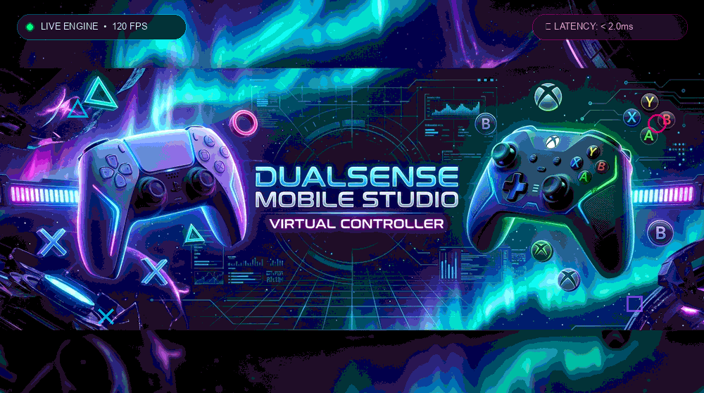
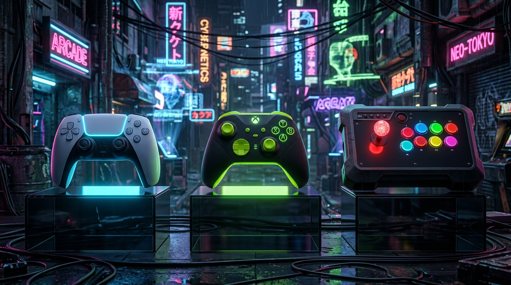
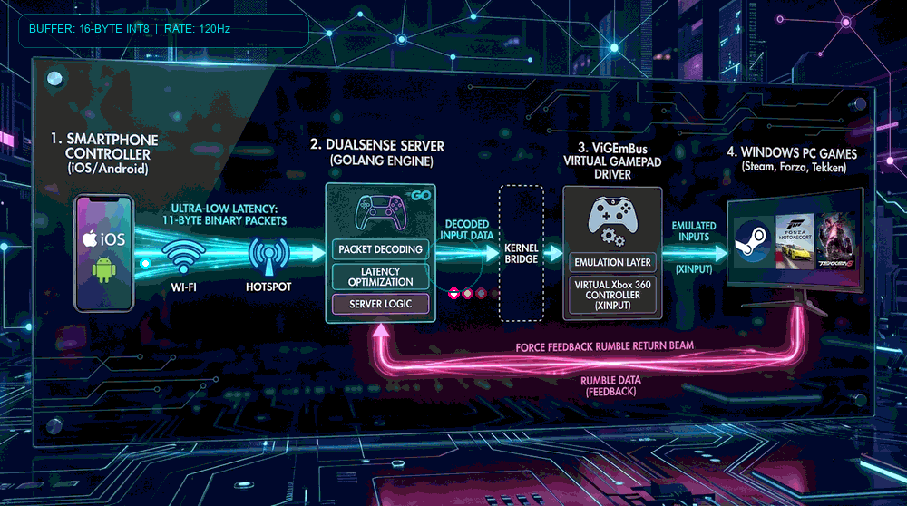

<div align="center">



<br/><br/>

[](https://go.dev/)
[](https://microsoft.com)
[](https://github.com/nefarius/ViGEmBus)
[](https://tools.ietf.org/html/rfc6455)
[](LICENSE)

[Features](#-key-features) • [Prerequisites](#-prerequisites) • [Quick Start](#-quick-start) • [Controls & Modes](#-controller-modes) • [Architecture](#-architecture) • [Building](#-build-from-source)

</div>

---

## 🌟 Overview

**DualSense Mobile Studio** transforms any modern smartphone (iOS or Android) into a tournament-grade, responsive virtual gamepad for Windows PC. Powered by the native **ViGEmBus (Virtual Gamepad Emulation)** kernel driver, your PC recognizes your phone as a genuine physical **Xbox 360 / DualShock 4 Controller** compatible with Steam, Epic Games, EA Play, Xbox Game Pass, emulators (RPCS3, PCSX2, Yuzu), and PC fighting games.

No mobile app installation required! Simply open your mobile browser, scan the QR code, and start playing wirelessly over local Wi-Fi or Windows Mobile Hotspot with **near-zero input latency (<2ms)**.

---

## ✨ Key Features

- 🎮 **Three Pro Controller Profiles**:
  - **PS5 DualSense**: Precision D-pad, dual clickable analog thumbs (L3/R3), analog triggers (L2/R2), touchpad swipe, and ergonomic face buttons.
  - **Xbox Series X**: Offset asymmetrical thumbsticks, LB/LT/RB/RT triggers, Nexus guide button, and A/B/X/Y layout.
  - **Sanwa Arcade Fightstick / Hitbox**: 8-button Japanese Vewlix arcade layout with dedicated Macro keys (Throw `LP+LK`, Parry `MP+MK`, EX-Trigger `HP+HK`) and instant toggle between 360° Sanwa Joystick and Leverless Hitbox buttons.
- ⚡ **Zero-Latency Binary Engine**:
  - Direct 11-byte packed binary packet protocol over low-overhead WebSockets and high-speed UDP (Port 9050) delivering consistent **60–120 FPS input polling**.
- 🎯 **Gyro POV Motion Aiming**:
  - Built-in sensor fusion using device accelerometer and gyroscope for precision tilt-to-look camera control and FPS aiming.
- 📳 **Real Dual-Motor Game Force Feedback (Rumble)**:
  - Translates in-game heavy and light vibration motor telemetry from games (Steam, Forza, Tekken, etc.) into dual-layer phone vibration: physical haptic actuator pulses and acoustic speaker-coil rumble with on-screen visual shockwaves.
- 👥 **2-Player Local Co-Op (P1 / P2 Slots)**:
  - Seamlessly toggle between Player 1 and Player 2 with glowing visual indicators (Cyan `P1` vs Neon Red `P2`). Two phones can connect simultaneously for 2-player co-op gaming.
- 💾 **Profile & Layout Customization Studio**:
  - Drag, drop, and scale every button and joystick individually.
  - Create, save, export, and import unlimited custom profiles saved directly in browser storage.
- 🎨 **Dynamic Aurora Visual FX**:
  - Multi-layer real-time cosmic aurora background mesh, retro cybernetic perspective grid, floating console glyphs, and responsive click shockwaves.
- 📶 **One-Click Windows Hotspot Automation**:
  - Play on the go without a Wi-Fi router. The built-in hotspot manager automatically enables Windows Mobile Hotspot and connects phones directly to the PC.
- 🗗 **Cross-Browser Fullscreen**:
  - Immersive borderless gameplay on Android Chrome, Samsung Internet, and iOS Safari ("Add to Home Screen" PWA mode).

---

## 📋 Prerequisites

1. **Windows 10 or 11 (64-bit)**
2. **ViGEmBus Kernel Driver**:
   - The virtual gamepad driver is required for Windows to recognize virtual controllers.
   - Download and run the official installer: **[ViGEmBus v1.22.0 Release](https://github.com/nefarius/ViGEmBus/releases/latest)** (Install `ViGEmBus_Setup_1.22.0.exe`).
3. **Local Network**:
   - PC and phone connected to the same Wi-Fi network, OR connect the phone to the PC's Windows Mobile Hotspot.

---

## 🚀 Quick Start

### 1. Launch the Server
Double-click the launcher script in the project root:
```cmd
START_DUALSENSE_SERVER.bat
```
The server will automatically start, detect your local IP address, check for the ViGEm kernel driver, and open the **Desktop Dashboard**.

### 2. Connect Your Phone
1. In the Desktop Dashboard, scan the displayed **QR Code** using your smartphone camera.
2. *Or* open your mobile browser and navigate to:
   ```
   http://<YOUR_PC_IP>:8080
   ```
   *(e.g., `http://192.168.29.148:8080`)*
3. Tap **[⛶ Fullscreen]** in the top bar for an immersive full-screen experience.
4. Launch any game on PC and start playing!

---

## 🎮 Controller Modes



<br/><br/>

| Mode | Visual Theme | Best For | Key Controls |
| :--- | :--- | :--- | :--- |
| **PS5 DualSense** | Glacier Blue & Navy | Action, Adventure, Racing | D-Pad, Dual Sticks, Touchpad, L1/L2/R1/R2, M1/M2 Back Paddles |
| **Xbox Series X** | Toxic Neon Green & Carbon | FPS, Shooters, Game Pass | Offset Thumbsticks, LB/LT/RB/RT, Nexus Xbox Logo |
| **Arcade Fightstick** | Sanwa Gold & Dark Slate | Fighting Games (Tekken, SF6, MK) | 8-Button Arcade layout, Sanwa Joystick / Leverless Hitbox, Throw/Parry Macros |

---

## 📂 Project Architecture

```
d:\vib/
├── DualSenseServer.exe            # High-performance compiled Windows server binary
├── START_DUALSENSE_SERVER.bat     # 1-Click launcher script
├── build.bat                      # Automated Go build script
├── ViGEmClient.dll                # Windows Virtual Gamepad Bus DLL
├── config.json                    # Persistent server configuration
├── go.mod                         # Go module definition
├── README.md                      # Project documentation
├── LICENSE                        # MIT License
├── .gitignore                     # Git ignore rules
├── .gitattributes                 # Line-ending normalizations
│
├── server/                        # BACKEND SERVICES (Go)
│   ├── main.go                    # Server lifecycle, flags & clean shutdown
│   ├── config.go                  # Portable path resolver & settings persistence
│   ├── routes.go                  # HTTP routes, REST APIs & static file serving
│   ├── websocket.go               # Low-latency binary WebSocket protocol (RFC6455)
│   ├── udp.go                     # High-speed UDP receiver (Port 9050)
│   ├── vigem.go                   # ViGEmBus C-binding & game rumble callback
│   ├── hotspot_windows.go         # Windows Mobile Hotspot control & query API
│   ├── tray_windows.go            # Windows System Tray icon & context menu
│   ├── web_controller.html        # Embedded production mobile controller bundle
│   └── dashboard.html             # Embedded production desktop monitor bundle
│
├── web/                           # MODULAR FRONTEND ASSETS
│   ├── controller/                # Mobile Web Controller
│   │   ├── index.html             # Modular controller markup
│   │   ├── css/                   # Theme, controller, aurora & modal stylesheets
│   │   └── js/                    # Input, haptics, network, profile & fullscreen modules
│   └── dashboard/                 # Desktop Monitor Dashboard
│       ├── index.html             # Modular dashboard markup
│       ├── css/dashboard.css      # Visualizer, telemetry & meter styles
│       └── js/dashboard.js        # Real-time WebSocket visualizer & controls
│
└── docs/
    └── ARCHITECTURE.md            # Deep-dive architecture & data flow diagrams
```

---

## 🛠️ Build From Source

### Requirements:
- [Go 1.20 or newer](https://go.dev/dl/)

### Compile Binary:
You can build the binary in 1 click using `build.bat`:
```cmd
build.bat
```

Or manually using the Go CLI:
```bash
go build -ldflags="-s -w" -o DualSenseServer.exe ./server
```

---

## 📡 Network & Binary Protocol



<br/><br/>

The web controller sends compact 11-byte binary packets over WebSockets or UDP to minimize packet overhead:

```
┌────────┬────────┬────────┬────────┬────────┬────────┬────────┬────────┬────────┬────────┬────────┐
│ Byte 0 │ Byte 1 │ Byte 2 │ Byte 3 │ Byte 4 │ Byte 5 │ Byte 6 │ Byte 7 │ Byte 8 │ Byte 9 │Byte 10 │
├────────┼────────┼────────┼────────┼────────┼────────┼────────┴────────┼────────┴────────┼────────┤
│ Stick  │ Stick  │ Stick  │ Stick  │ Trigger│ Trigger│   Buttons Low   │   Buttons High  │ Player │
│ Left X │ Left Y │ Right X│ Right Y│   L2   │   R2   │    (16-bit)     │    (16-bit)     │  Slot  │
└────────┴────────┴────────┴────────┴────────┴────────┴─────────────────┴─────────────────┴────────┘
```

- **Byte 0–3**: Analog Thumbsticks (0–255, 128 = Center)
- **Byte 4–5**: Analog Triggers L2 / R2 (0–255)
- **Byte 6–9**: 32-bit Button bitmask (Face buttons, D-pad, Shoulders, Macros)
- **Byte 10**: Player Slot (`1` = Player 1, `2` = Player 2)

---

## ❓ Troubleshooting & FAQ

<details>
<summary><b>1. Games do not detect any controller</b></summary>

- Make sure you have installed the **[ViGEmBus Driver](https://github.com/nefarius/ViGEmBus/releases/latest)**.
- Press Windows Key + R, type `joy.cpl` and hit Enter. You should see "Controller (XBOX 360 For Windows)" listed with OK status.
- Restart the game after starting the server.
</details>

<details>
<summary><b>2. Phone cannot connect to the PC</b></summary>

- Verify that your PC and phone are on the **exact same Wi-Fi network**.
- Check Windows Firewall: allow incoming connections on port `8080` (TCP) and `9050` (UDP).
- Alternatively, toggle **Windows Mobile Hotspot** from the Dashboard and connect your phone directly to the hotspot Wi-Fi.
</details>

<details>
<summary><b>3. Fullscreen on iPhone / iPad (iOS Safari)</b></summary>

Apple disables standard HTML5 Fullscreen in mobile Safari. To get 100% full screen without browser address bars:
1. Open the controller in Safari.
2. Tap the **Share icon (📤)** at the bottom.
3. Tap **"Add to Home Screen"**.
4. Open the created icon from your Home Screen — it will run in standalone full-screen mode!
</details>

---

## 📄 License

This project is licensed under the [MIT License](LICENSE) — free for personal and commercial use.

<div align="center">
Made with ❤️ for gamers and developers.
</div>
